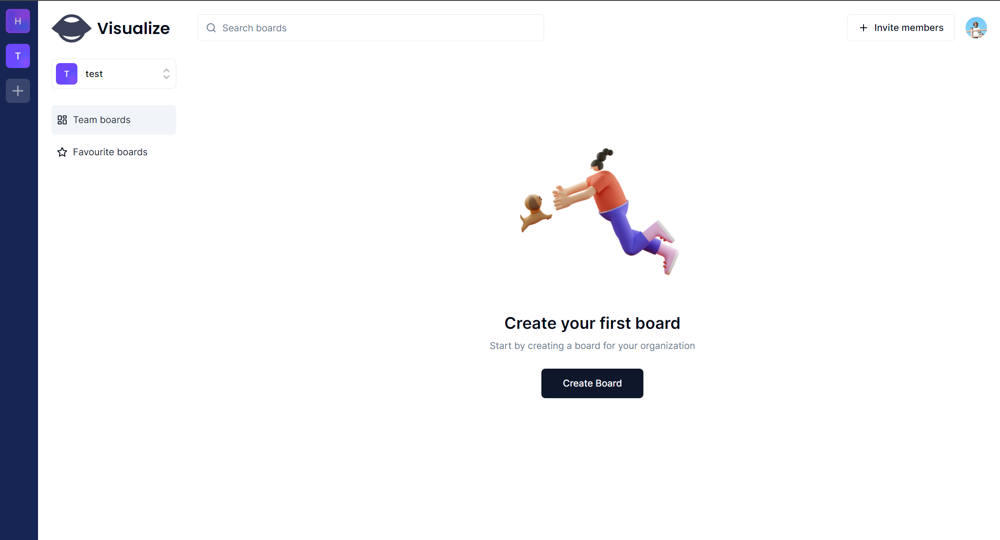
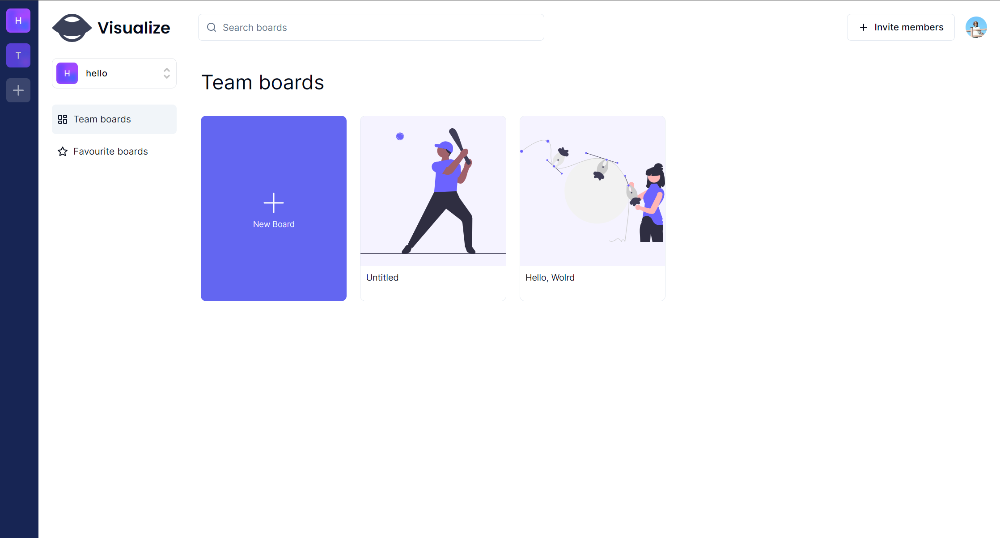
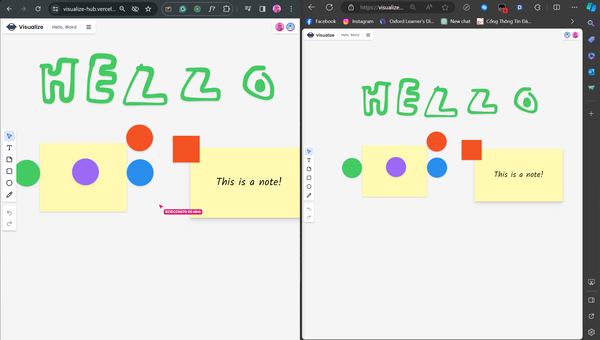

# VisualizeHub

<div align="center">
  
</div>

Welcome to VisualizeHub - Your Collaborative Visual Workspace!

VisualizeHub is an collaborative visual workspace designed to unleash creativity, streamline teamwork, and bring ideas to life. Whether you're a creative professional, project manager, educator, or part of a remote team, VisualizeHub provides a versatile platform for ideation, planning, and innovation.

## 🚀 Key Features

- **Infinite Canvas:** Explore boundless creativity with an infinite digital canvas.
- **Real-Time Collaboration:** Collaborate seamlessly with team members in real-time.
- **Intuitive Design Interface:** Craft your vision effortlessly with a user-friendly drag-and-drop interface.
- **Privacy and Permissions:** Control access with robust permission controls for a secure and personalized experience.

## 📷 Screenshots

<div align="center">
  
  <br>
  <em>VisualizeHub dashboard</em>
</div>

<div align="center">
  
  <br>
  <em>VisualizeHub in Action</em>
</div>

<div align="center">
  
  <br>
  <em>Real-Time Collaboration</em>
</div>

## 🛠️ Technology Stack

- [Next.js](https://nextjs.org/)
- [Tailwind CSS](https://tailwindcss.com/)
- [TypeScript](https://www.typescriptlang.org/)
- [Convex](https://convex.dev/)
- [Clerk](https://clerk.dev/)
- [Liveblock](https://liveblock.io/)

## 🌟 Getting Started

### Prerequisites

- Ensure you have [Node.js](https://nodejs.org/) installed.
- Clone the VisualizeHub repository to your local machine.

````bash
git clone https://github.com/khoido2003/VisualizeHub.git


## Getting Started

First, run the development server:

```bash
npm run dev
# or
yarn dev
# or
pnpm dev
# or
bun dev
````

Open [http://localhost:3000](http://localhost:3000) with your browser to see the result.

You can start editing the page by modifying `app/page.tsx`. The page auto-updates as you edit the file.

This project uses [`next/font`](https://nextjs.org/docs/basic-features/font-optimization) to automatically optimize and load Inter, a custom Google Font.

## Learn More

To learn more about Next.js, take a look at the following resources:

- [Next.js Documentation](https://nextjs.org/docs) - learn about Next.js features and API.
- [Learn Next.js](https://nextjs.org/learn) - an interactive Next.js tutorial.

You can check out [the Next.js GitHub repository](https://github.com/vercel/next.js/) - your feedback and contributions are welcome!

## Deploy on Vercel

The easiest way to deploy your Next.js app is to use the [Vercel Platform](https://vercel.com/new?utm_medium=default-template&filter=next.js&utm_source=create-next-app&utm_campaign=create-next-app-readme) from the creators of Next.js.

Check out our [Next.js deployment documentation](https://nextjs.org/docs/deployment) for more details.
